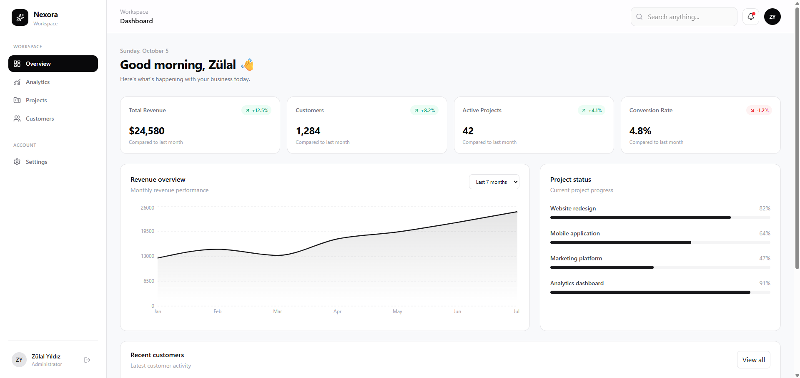
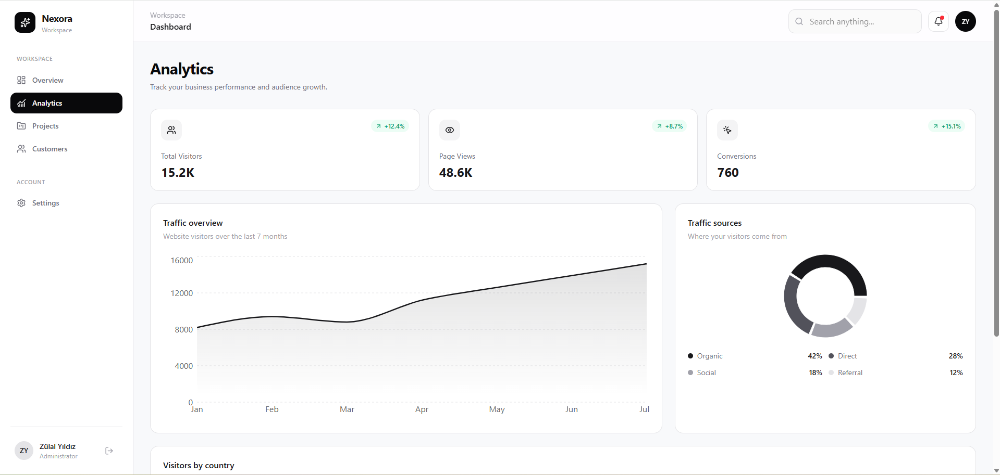
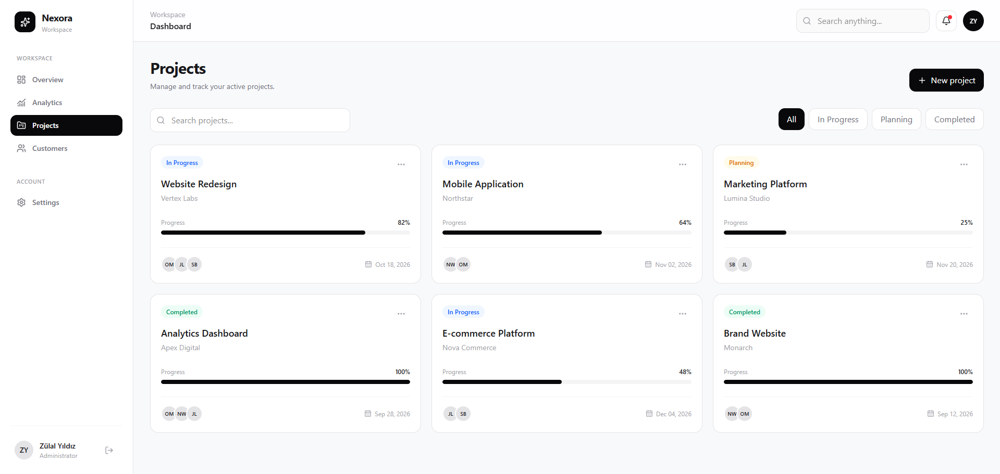
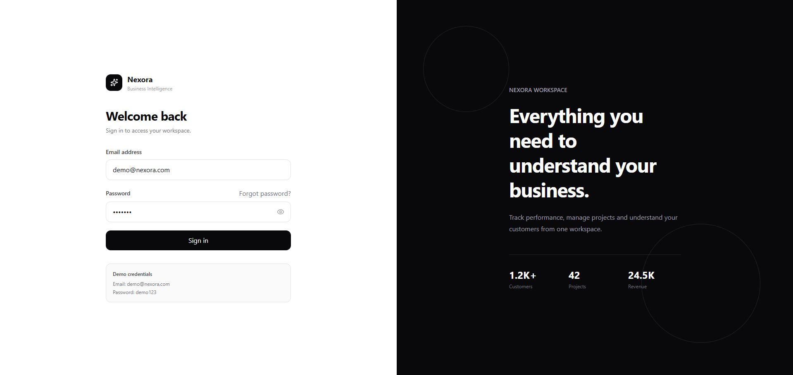

# Nexora Dashboard

A modern and responsive SaaS business dashboard built with React and TypeScript.

Nexora provides a clean workspace for monitoring business performance, managing projects, exploring analytics and organizing customer data.

## Preview

### Dashboard



### Analytics



### Project Management



### Login



## Features

- Responsive SaaS dashboard interface
- Business performance overview
- Interactive analytics and charts
- Project management dashboard
- Project search and status filtering
- Customer management
- Customer search and filtering
- Responsive mobile navigation
- Light and dark mode
- Persistent theme preference
- Demo authentication
- Protected routes
- Persistent demo session
- Responsive data tables
- Mobile-friendly interface

## Tech Stack

- React
- TypeScript
- Vite
- Tailwind CSS
- React Router
- Recharts
- Lucide React

## Application Pages

### Dashboard
Overview of revenue, customers, active projects, conversion rates and recent activity.

### Analytics
Interactive visualizations for traffic, conversions, traffic sources and geographic performance.

### Projects
Project management interface with search, status filtering, progress tracking and deadlines.

### Customers
Customer management interface with search, status filters and customer activity information.

### Settings
Workspace preferences including persistent light and dark themes.

## Demo Authentication

Nexora includes frontend-only demo authentication for demonstration purposes.

**Email**

```text
demo@nexora.com
```

**Password**

```text
demo123
```

> Authentication in this project is intentionally simulated on the client side. It should not be used as a production authentication implementation.

## Getting Started

Clone the repository:

```bash
git clone https://github.com/yildizulal/nexora-dashboard.git
```

Navigate to the project:

```bash
cd nexora-dashboard
```

Install dependencies:

```bash
npm install
```

Start the development server:

```bash
npm run dev
```

## Build

Create a production build:

```bash
npm run build
```

## Responsive Design

Nexora is designed for desktop, tablet and mobile devices. The interface includes responsive layouts, mobile navigation and horizontally scrollable data tables where necessary.

## Project Purpose

Nexora was created as a frontend portfolio project demonstrating modern React development, TypeScript, component-based architecture, routing, state management, responsive UI design and data visualization.

## Developer

**Zülal Yıldız**  
Full-Stack Developer

Portfolio: https://www.zulalyildizagency.com
